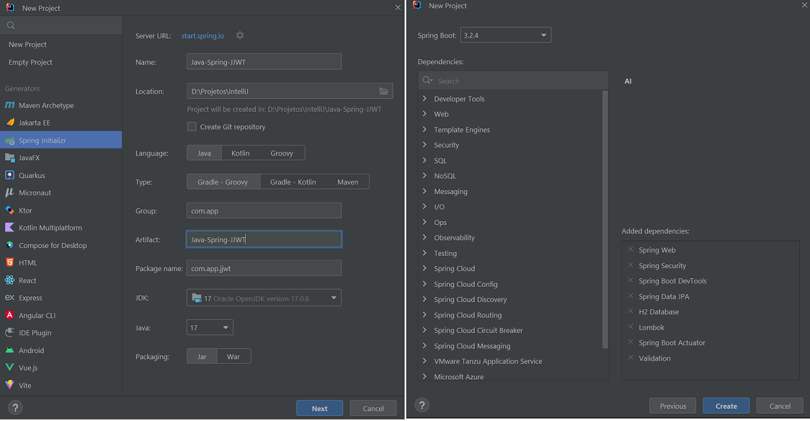
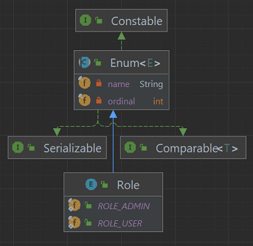
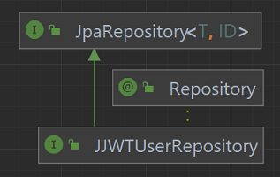
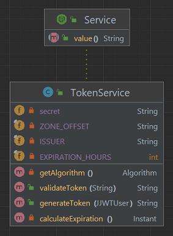
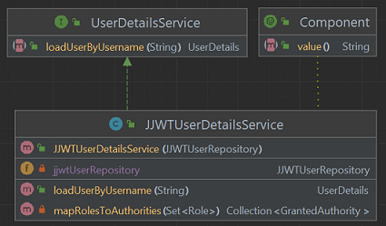
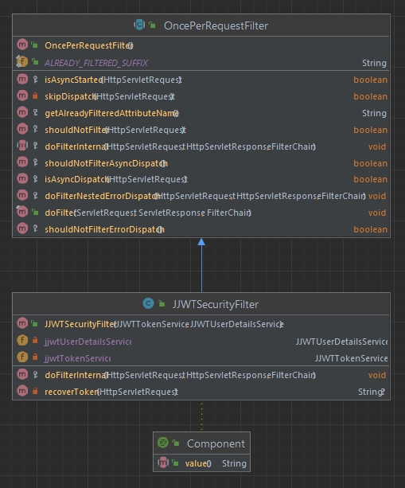

# Spring Security - Java JSON Web Token (JJWT)
Projeto em Java com Spring e Gradle para autenticação usando Java JSON Web Token (JJWT).


## Passos
Os passos da implementação do projeto:

1. Criar projeto (no IntelliJ) com:
- Linguagem Java (17);
- Spring Framework (6.2.3);
- Dependências: Web, Security, DevTools, JPA, H2, Lombok, Actuator, Validation.



2. Adicionar dependência java-jwt do Auth0 obtida no 
[Maven Repository](https://mvnrepository.com/artifact/com.auth0/java-jwt/4.4.0)
para o arquivo `build.gradle` (ou `pom.xml`):

```groovy
implementation group: 'com.auth0', name: 'java-jwt', version: '4.4.0'
```
ou
```groovy
implementation 'com.auth0:java-jwt:4.4.0'
```
ou
```xml
<dependency>
    <groupId>com.auth0</groupId>
    <artifactId>java-jwt</artifactId>
    <version>4.4.0</version>
</dependency>
```

3. Adicionar configurações de datasource, jpa e h2 em `application.properties`:

```properties
# ===================================================================
#                   APPLICATION
# ===================================================================
spring.application.name=Java-Spring-JJWT
# ===================================================================
#                   DATASOURCE AND H2 DATABASE
# ===================================================================
# H2 - Datasource
spring.datasource.url=jdbc:h2:mem:jjwtapp
spring.datasource.driverClassName=org.h2.Driver
spring.datasource.username=admin
spring.datasource.password=admin
# H2 - Console
spring.h2.console.enabled=true
spring.h2.console.path=/h2
# Hibernate
spring.jpa.database-platform=org.hibernate.dialect.H2Dialect
#spring.jpa.hibernate.ddl-auto=create-drop
spring.jpa.hibernate.ddl-auto=update
# http://localhost:8080/h2/
```

4. Adicionar Enum `Role` que pode ser `ROLE_USER` ou `ROLE_ADMIN`:



5. Adicionar Classe `JJWTUser`:
- anotada com @Entity, @Table(name="jjwt_users"), @Data, @NoArgsConstructor, @AllArgsConstructor;
- com atributos id, name, login, password, roles.


6. Adicionar Interface `JJWTUserRepository`:
- anotada com `@Repository`;
- extends `JpaRepository<JJWTUser, String>`;
- tem o método `Optional<JJWTUser> findByLogin(String login)`;



7. Adicionar um valor para `api.security.token.secret` em `application.properties`:

```properties
# ===================================================================
#                   SECURITY
# ===================================================================
api.security.token.secret=chaveSecreta
```

8. Adicionar Classe `TokenService`:
- no pacote `security`;
- com os atributos `secret`, `ISSUER`, `EXPIRATION_HOURS` e `ZONE_OFFSET`;
- com os métodos privados `Instant calculateExpiration()` e `Algorithm getAlgorithm()`;
- com métodos públicos `String generateToken(JJWTUser jjwtUser)` e `String validateToken(String token)`.



9. Criar Classe `JJWTUserDetailsService`:
- no pacote `security`;
- implementa `UserDetailsService`;
- com atributo `JJWTUserRepository jjwtUserRepository`;
- com um construtor com o atributo injetado;
- com um método público `UserDetails loadUserByUsername(String username)`;
- com um método privado `Collection<? extends GrantedAuthority> mapRolesToAuthorities(Set<Role> roles)`.



10. Criar Classe `JJWTSecurityFilter`
- no pacote `security`;
- anotada com `@Component`;
- estende `OncePerRequestFilter`;
- com atributos `jjwtTokenService` e `jjwtUserDetailsService`;
- com um construtor com os atributos injetados;
- com um método protegido `void doFilterInternal()`;
- com um método privado `String recoverToken(HttpServletRequest request)`.




## Referências
Maven Repository - Auth0 - Java JWT:
https://mvnrepository.com/artifact/com.auth0/java-jwt/4.4.0

Fernanda Kipper | Dev - PROJETO FULLSTACK COM LOGIN USANDO SPRING SECURITY + JWT | BACKEND:
https://www.youtube.com/watch?v=tJCyNV1G0P4

Fernanda Kipper | Dev - Autenticação e Autorização com Spring Security, JWT Tokens e Roles:
https://www.youtube.com/watch?v=5w-YCcOjPD0

GitBook - Auth Database - Gleyson Sampaio: 
https://glysns.gitbook.io/spring-framework/spring-security/auth-database

GitBook - JWT - JSON Web Token - Gleyson Sampaio: 
https://glysns.gitbook.io/spring-framework/spring-security/spring-security-e-jwt