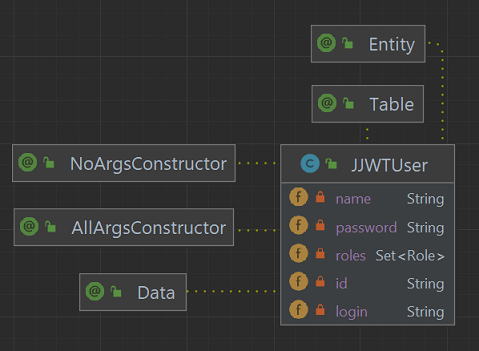
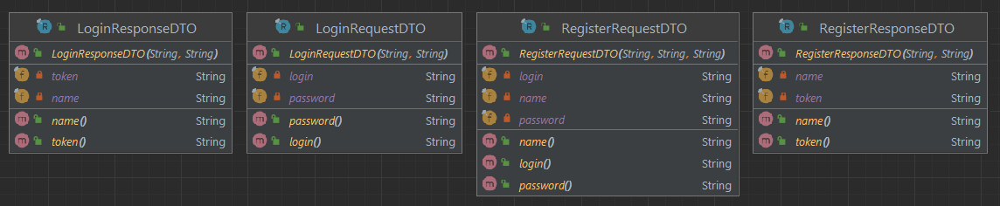

# Spring Security - Java JSON Web Token (JJWT)
Projeto em Java com Spring e Gradle para autenticação usando Java JSON Web Token (JJWT).


## Passos
Os passos da implementação do projeto:

1. Criar projeto (no IntelliJ) com:
- Linguagem Java (17);
- Spring Framework (6.2.3);
- Dependências: Web, Security, DevTools, JPA, H2, Lombok, Actuator, Validation.


2. Adicionar dependência java-jwt do Auth0 obtida no 
[Maven Repository](https://mvnrepository.com/artifact/com.auth0/java-jwt/4.4.0)
para o arquivo `build.gradle` (ou `pom.xml`):

```groovy
implementation group: 'com.auth0', name: 'java-jwt', version: '4.4.0'
```
ou
```groovy
implementation 'com.auth0:java-jwt:4.4.0'
```
ou
```xml
<dependency>
    <groupId>com.auth0</groupId>
    <artifactId>java-jwt</artifactId>
    <version>4.4.0</version>
</dependency>
```

3. Adicionar configurações de datasource, jpa e h2 em `application.properties`:

```properties
# ===================================================================
#                   APPLICATION
# ===================================================================
spring.application.name=Java-Spring-JJWT
# ===================================================================
#                   DATASOURCE AND H2 DATABASE
# ===================================================================
# H2 - Datasource
spring.datasource.url=jdbc:h2:mem:jjwtapp
spring.datasource.driverClassName=org.h2.Driver
spring.datasource.username=admin
spring.datasource.password=admin
# H2 - Console
spring.h2.console.enabled=true
spring.h2.console.path=/h2
# Hibernate
# spring.jpa.database-platform=org.hibernate.dialect.H2Dialect
#spring.jpa.hibernate.ddl-auto=create-drop
spring.jpa.hibernate.ddl-auto=update
# http://localhost:8080/h2/
```

4. Adicionar Enum `Role` que pode ser `ROLE_USER` ou `ROLE_ADMIN`:


5. Adicionar Classe `JJWTUser`:
- anotada com `@Entity`, `@Table(name="jjwt_users")`, `@Data`, `@NoArgsConstructor`, `@AllArgsConstructor`;
- com atributos `id`, `name`, `login`, `password`, `roles`.



6. Adicionar Interface `JJWTUserRepository`:
- anotada com `@Repository`;
- extends `JpaRepository<JJWTUser, String>`;
- tem o método `Optional<JJWTUser> findByLogin(String login)`;


7. Adicionar um valor para `api.security.token.secret` em `application.properties`:

```properties
# ===================================================================
#                   SECURITY
# ===================================================================
api.security.token.secret=chaveSecreta
```

8. Adicionar Classe `JJWTTokenService`:
- no pacote `security`;
- com os atributos `secret`, `ISSUER`, `EXPIRATION_HOURS` e `ZONE_OFFSET`;
- com os métodos privados `Instant calculateExpiration()` e `Algorithm getAlgorithm()`;
- com métodos públicos `String generateToken(JJWTUser jjwtUser)` e `String validateToken(String token)`.


9. Adicionar Classe `JJWTUserDetailsService`:
- no pacote `security`;
- implementa `UserDetailsService`;
- com atributo `JJWTUserRepository jjwtUserRepository`;
- com um construtor com o atributo injetado;
- com um método público `UserDetails loadUserByUsername(String username)`;
- com um método privado `Collection<? extends GrantedAuthority> mapRolesToAuthorities(Set<Role> roles)`.


10. Adicionar Classe `JJWTSecurityFilter`:
- no pacote `security`;
- anotada com `@Component`;
- estende `OncePerRequestFilter`;
- com atributos `jjwtTokenService` e `jjwtUserDetailsService`;
- com um construtor com os atributos injetados;
- com um método protegido `void doFilterInternal()`;
- com um método privado `String recoverToken(HttpServletRequest request)`.


11. Adicionar Classe `JJWTSecurityConfig`:
- no pacote `security`;
- anotada com `@Configuration`, `@EnableWebSecurity`;
- com atributos `jjwtSecurityFilter` e `jjwtUserDetailsService`;
- com um construtor com os atributos injetados;
- com os método publicos `SecurityFilterChain securityFilterChain`, `PasswordEncoder passwordEncoder()`, 
  `AuthenticationManager authenticationManager` anotados com `@Bean`;


12. Adicionar records DTOs:
- no pacote `dtos`;
- `LoginRequestDTO` contém `login` e `password`;
- `LoginResponseDTO` contém `name` e `token`;
- `RegisterRequestDTO` contém `name`, `login` e `password`;
- `RegisterResponseDTO` contém `name` e `token`.



13. Adicionar Interface `AuthService`:
- no pacote `services`;
- com métodos `LoginResponseDTO login(LoginRequestDTO loginRequestDTO)` e 
  `RegisterResponseDTO register(RegisterRequestDTO registerRequestDTO)`.

14. Adicionar Classe `AuthServiceImpl`:
- no pacote `services`;
- anotada com `@Service`;
- implementa `AuthService`;
- com atributos `PasswordEncoder passwordEncoder`, `JJWTUserRepository jjwtUserRepository` e 
  `JJWTTokenService jjwtTokenService`;
- com um construtor com os atributos injetados;


15. Adicionar Classe `AuthController`:
- no pacote `controllers`;
- anotada com `@RestController` e `@RequestMapping("/auth")`;
- com o atributo `AuthService authService`;
- com um construtor com o atributo injetado;
- com os métodos: 
  * `ResponseEntity<LoginResponseDTO> login(@RequestBody LoginRequestDTO loginRequestDTO)` para `@PostMapping("/login")`;
  * `ResponseEntity<RegisterResponseDTO> register(@RequestBody RegisterRequestDTO registerRequestDTO)` para 
    `@PostMapping("/register")`;
  * `ResponseEntity<String> authenticatedUsers()` para `@GetMapping("/users")`;
  * `ResponseEntity<String> authenticatedAdmins()` para `@GetMapping("/admins")`.


16. Adicionar rotas e suas permissões no método `securityFilterChain` de `JJWTSecurityConfig`.

17. Testar rotas, autenticação e autorização com POSTMAN:


## Referências
Maven Repository - Auth0 - Java JWT:
https://mvnrepository.com/artifact/com.auth0/java-jwt/4.4.0

Fernanda Kipper | Dev - PROJETO FULLSTACK COM LOGIN USANDO SPRING SECURITY + JWT | BACKEND:
https://www.youtube.com/watch?v=tJCyNV1G0P4 | 
https://github.com/Fernanda-Kipper/login-app-backend/tree/main

Fernanda Kipper | Dev - Autenticação e Autorização com Spring Security, JWT Tokens e Roles:
https://www.youtube.com/watch?v=5w-YCcOjPD0

GitBook - Auth Database - Gleyson Sampaio: 
https://glysns.gitbook.io/spring-framework/spring-security/auth-database

GitBook - JWT - JSON Web Token - Gleyson Sampaio: 
https://glysns.gitbook.io/spring-framework/spring-security/spring-security-e-jwt