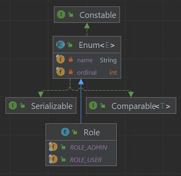
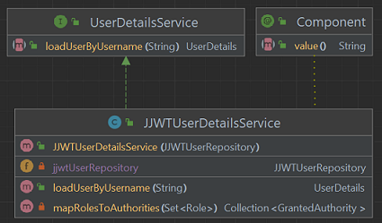
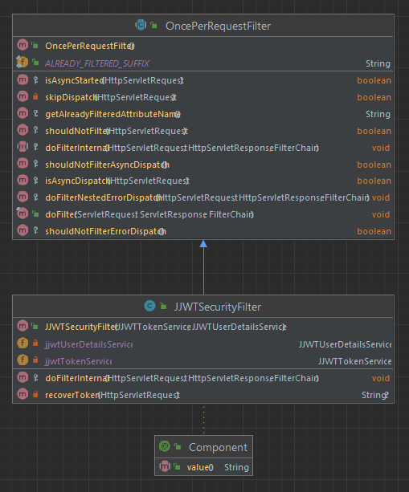
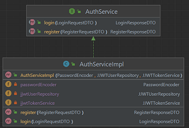

# Spring Security - Java JSON Web Token (JJWT)
Java project with Spring and Gradle for authentication using Java JSON Web Token (JJWT).


## Steps
The steps of project implementation:

1. Create project (in IntelliJ) with:
- Java language (17);
- Spring Framework (6.2.3);
- Dependencies: Web, Security, DevTools, JPA, H2, Lombok, Actuator, Validation.


2. Add Auth0 java-jwt dependency obtained from
   [Maven Repository](https://mvnrepository.com/artifact/com.auth0/java-jwt/4.4.0)
   for the `build.gradle` (or `pom.xml`) file:

```groovy
implementation group: 'com.auth0', name: 'java-jwt', version: '4.4.0'
```
or
```groovy
implementation 'com.auth0:java-jwt:4.4.0'
```
or
```xml
<dependency>
    <groupId>com.auth0</groupId>
    <artifactId>java-jwt</artifactId>
    <version>4.4.0</version>
</dependency>
```

3. Add datasource, jpa and h2 settings in `application.properties`:

```properties
# ===================================================================
#                   APPLICATION
# ===================================================================
spring.application.name=Java-Spring-JJWT
# ===================================================================
#                   DATASOURCE AND H2 DATABASE
# ===================================================================
# H2 - Datasource
spring.datasource.url=jdbc:h2:mem:jjwtapp
spring.datasource.driverClassName=org.h2.Driver
spring.datasource.username=admin
spring.datasource.password=admin
# H2 - Console
spring.h2.console.enabled=true
spring.h2.console.path=/h2
# Hibernate
spring.jpa.database-platform=org.hibernate.dialect.H2Dialect
#spring.jpa.hibernate.ddl-auto=create-drop
spring.jpa.hibernate.ddl-auto=update
# http://localhost:8080/h2/
```

4. Add Enum `Role` which can be `ROLE_USER` or `ROLE_ADMIN`:



5. Add Class `JJWTUser`:
- annotated with @Entity, @Table(name="jjwt_users"), @Data, @NoArgsConstructor, @AllArgsConstructor;
- with attributes id, name, login, password, roles.


6. Add `JJWTUserRepository` Interface:
- annotated with `@Repository`;
- extends `JpaRepository<JJWTUser, String>`;
- has the method `Optional<JJWTUser> findByLogin(String login)`;


7. Add a value for `api.security.token.secret` in `application.properties`:

```properties
# ===================================================================
#                   SECURITY
# ===================================================================
api.security.token.secret=chaveSecreta
```

8. Add `JJWTTokenService` Class:
- in the `security` package;
- with the attributes `secret`, `ISSUER`, `EXPIRATION_HOURS` and `ZONE_OFFSET`;
- with the private methods `Instant calculateExpiration()` and `Algorithm getAlgorithm()`;
- with public methods `String generateToken(JJWTUser jjwtUser)` and `String validateToken(String token)`.


9. Create Class `JJWTUserDetailsService`:
- in the `security` package;
- implements `UserDetailsService`;
- with attribute `JJWTUserRepository jjwtUserRepository`;
- with a constructor with the injected attribute;
- with a public method `UserDetails loadUserByUsername(String username)`;
- with a private method `Collection<? extends GrantedAuthority> mapRolesToAuthorities(Set<Role> roles)`.



10. Create `JJWTSecurityFilter` Class
- in the `security` package;
- annotated with `@Component`;
- extends `OncePerRequestFilter`;
- with attributes `jjwtTokenService` and `jjwtUserDetailsService`;
- with a constructor with injected attributes;
- with a protected method `void doFilterInternal()`;
- with a private method `String recoverToken(HttpServletRequest request)`.



11. Add `JJWTSecurityConfig` Class:
- in the `security` package;
- annotated with `@Configuration`, `@EnableWebSecurity`;
- with attributes `jjwtSecurityFilter` and `jjwtUserDetailsService`;
- with a constructor with injected attributes;
- with the public methods `SecurityFilterChain securityFilterChain`, `PasswordEncoder passwordEncoder()`,
  `AuthenticationManager authenticationManager` annotated with `@Bean`;


12. Add records DTOs:
- in the `dtos` package;
- `LoginRequestDTO` contains `login` and `password`;
- `LoginResponseDTO` contains `name` and `token`.
- `RegisterRequestDTO` contains `name`, `login` and `password`;
- `RegisterResponseDTO` contains `name` and `token`.


13. Add `AuthService` Interface:
- in the `services` package;
- with methods `LoginResponseDTO login(LoginRequestDTO loginRequestDTO)` and
  `RegisterResponseDTO register(RegisterRequestDTO registerRequestDTO)`.

14. Add `AuthServiceImpl` Class:
- in the `services` package;
- annotated with `@Service`;
- implements `AuthService`;
- with attributes `PasswordEncoder passwordEncoder`, `JJWTUserRepository jjwtUserRepository` and
  `JJWTTokenService jjwtTokenService`;
- with a constructor with injected attributes;




## References
Maven Repository - Auth0 - Java JWT:
https://mvnrepository.com/artifact/com.auth0/java-jwt/4.4.0

Fernanda Kipper | Dev - PROJETO FULLSTACK COM LOGIN USANDO SPRING SECURITY + JWT | BACKEND:
https://www.youtube.com/watch?v=tJCyNV1G0P4

Fernanda Kipper | Dev - Autenticação e Autorização com Spring Security, JWT Tokens e Roles:
https://www.youtube.com/watch?v=5w-YCcOjPD0

GitBook - Auth Database - Gleyson Sampaio:
https://glysns.gitbook.io/spring-framework/spring-security/auth-database

GitBook - JWT - JSON Web Token - Gleyson Sampaio:
https://glysns.gitbook.io/spring-framework/spring-security/spring-security-e-jwt